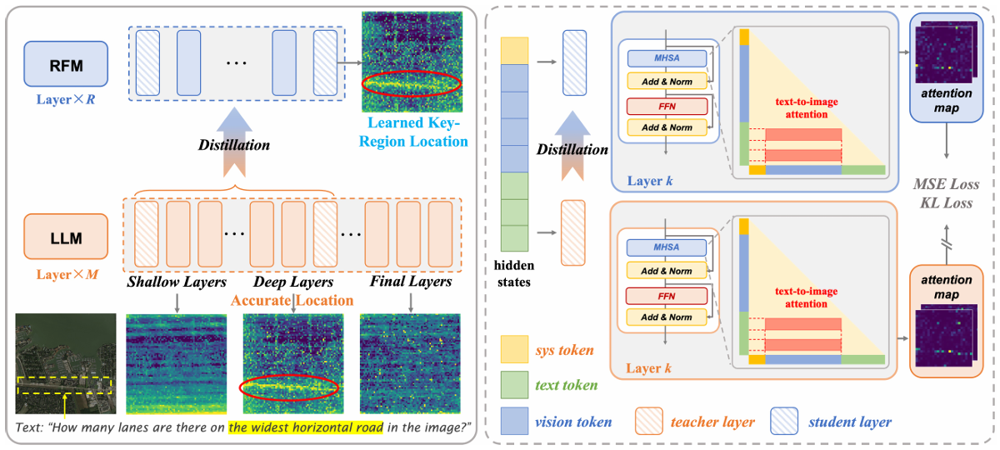
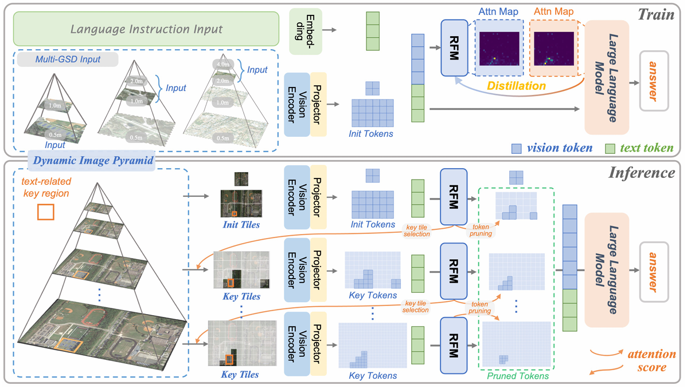
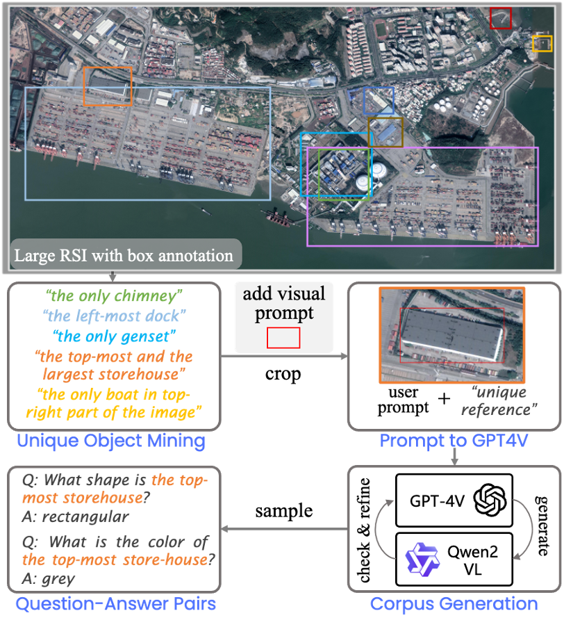
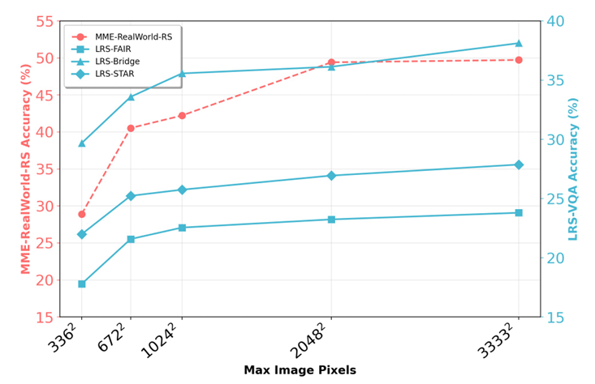
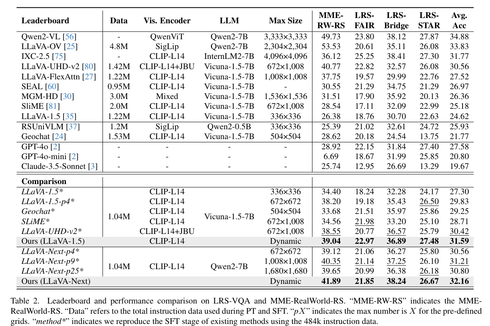
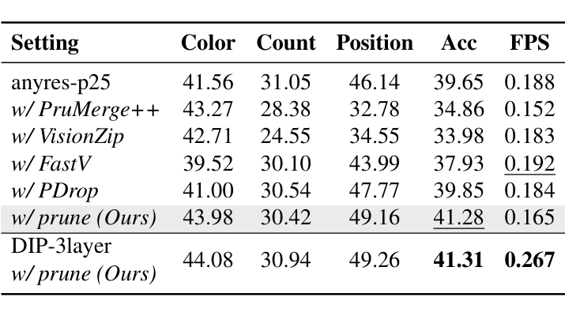
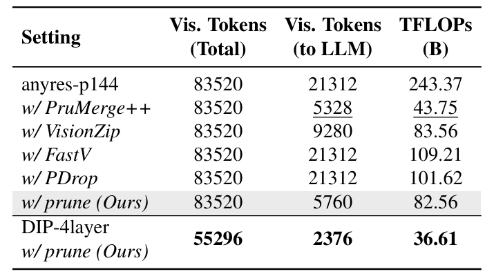
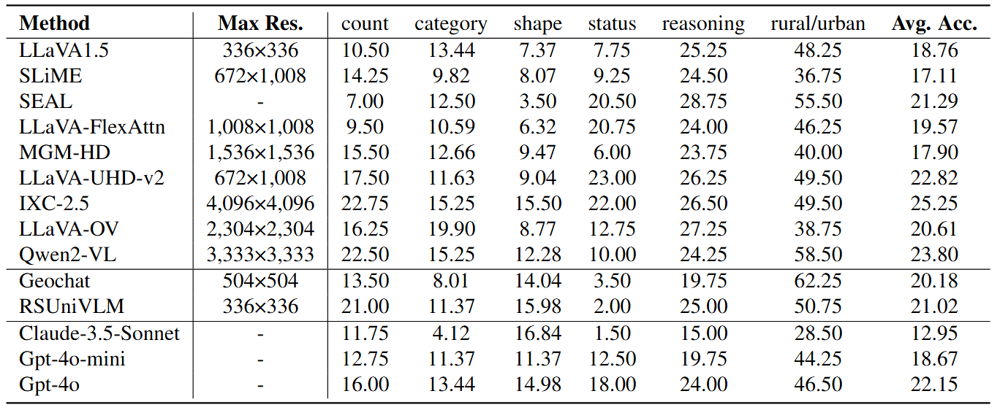
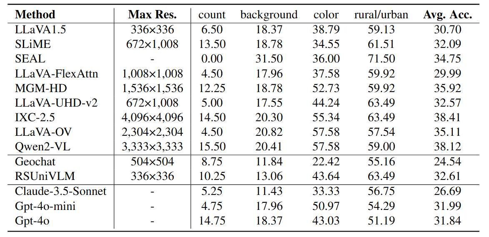
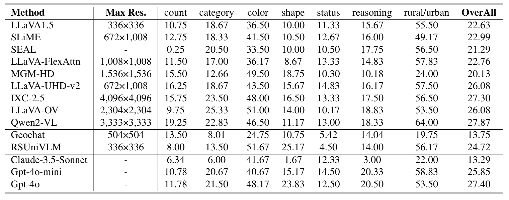

<font size=3><div align='center'>  
[[📖 arXiv Paper](https://arxiv.org/abs/2503.07588)] 
[[📊 LRS-VQA Dataset](https://huggingface.co/datasets/ll-13/LRS-VQA)] 
[[🛠️ Code](Script)] 

</div></font>

## When Large Vision-Language Model Meets Large Remote Sensing Imagery: Coarse-to-Fine Text-Guided Token Pruning

**[2025/3/11]** 🔥 **LRS-VQA** is now released! Code and weight will be released soon.


This project focuses on perception capabilities of Large Vision-Language Models (LVLMs) in the context of Large Remote Sensing Images (RSIs), covering the following key aspects:

- **Region Focus Module (RFM):** Learns text-aware key vision token localization capabilities through attention distillation, enabling focused analysis on critical image tiles.
- **Coarse-to-fine text-guided token pruning with Dynamic Image Pyramid (DIP):** Enhances both accuracy and efficiency in high-resolution settings.
- **LRS-VQA:** A new benchmark for Large RSI perception, featuring 7,333 QA pairs across 8 categories, with images reaching up to 27,328 pixels in length.

---

## 🛠️ **Method**

 Our method introduces: (i) a Region Focus Module (RFM) that leverages text-aware region localization capability to identify critical vision tokens, and (ii) a coarse-to-fine image tile selection and vision token pruning strategy based on DIP, which is guided by RFM outputs and avoids directly processing the entire large imagery.

#### 1. **Region Focus Module (RFM)**


<p align="center">Schematic illustration of the Region Focus Module (RFM).</p>

The RFM aims at learning text-aware key vision tokens localization by employing attention distillation, which allows the LVLM to focus on the most relevant parts of an image for detailed analysis.

#### 2. **Coarse-to-Fine Token Pruning**


<p align="center">The overall pipeline of our proposed method.</p>

Initially, the DIP is constructed based on the input large RSI. At the low-resolution DIP level, the RFM provides attention distribution for the initial vision tokens, which guides the retrieval of corresponding image tiles from higher-resolution DIP levels or trigger token pruning at the current level. This iterative process could continue through the pyramid until reaching the original resolution.

---

## 📚 **LRS-VQA Benchmark**


<p align="center">
    
</p>
<p align="center">
    Construction process of LRS-VQA.
</p>


[MME-RealWorld](https://github.com/yfzhang114/MME-RealWorld) has provided a high-quality benchmark for multiple domains. In the field of remote sensing, we aim to further enrich the types of tasks and reflect the challenges of large RSI perception. **LRS-VQA** includes 1,657 images ranging in length from **1,024 to 27,328 pixels**, covering 8 different types of questions, and contains **7,333** QA pairs.


<p align="center">
    
</p>
<p align="center">
    The accuracy trends of Qwen2-VL across varying input maximum pixels. This demonstrates that accuracy on both the manually annotated MME-RealWorld-RS and our proposed LRS-VQA exhibit a positive correlation with resolution improvement, proving the effectiveness of LRS-VQA in evaluating LVLM's high-resolution RSI perception capabilities.
</p>

### Download and Evaluation

To get started with the dataset and evaluation scripts, follow these steps:

- **Source Images:**
  The source images are collected from multiple datasets:
  - [FAIR1M](https://arxiv.org/abs/2103.05569) (train set)
  - [GLH-Bridge](https://huggingface.co/datasets/ll-13/GLH-Bridge/tree/main) (test set)
  - [STAR](https://huggingface.co/datasets/Zhuzi24/STAR/tree/main) (test set)
  
  The LRS-VQA dataset can be found at https://huggingface.co/datasets/ll-13/LRS-VQA.

- **Evaluation:**
  To evaluate your model on LRS-VQA, please refer to our provided script for generating results:
  - [LLaVA1.5 Inference Script](Script/llava_eval_LRSVQA.py)
  
  Once you have generated the result file using `llava_eval_LRSVQA.py`, you can use the following script to evaluate your model's performance:
  - [Script/evaluation_LRSVQA.py](Script/evaluation_LRSVQA.py)


### Results

<p align="center">
    
</p>
<p align="center">
    Leaderboard and performance comparision.
</p>

<p align="center">
  
  
</p>
<p align="center">
    Efficiency comparision.
</p>

## Detailed Result

<details>
<summary>Click to view detailed results in LRS-FAIR, LRS-Bridge, and LRS-STAR</summary>

<p align="center">
    
</p>
<p align="center">
    Detailed results in LRS-FAIR.
</p>

<p align="center">
    
</p>
<p align="center">
    Detailed results in LRS-Bridge.
</p>

<p align="center">
    
</p>
<p align="center">
    Detailed results in LRS-STAR.
</p>

</details>

<!-- <p align="center">
    
</p>
<p align="center">
    Detailed results in LRS-FAIR.
</p>


<p align="center">
    
</p>
<p align="center">
    Detailed results in LRS-Bridge.
</p>


<p align="center">
    
</p>
<p align="center">
    Detailed results in LRS-STAR.
</p> -->

## Citation

If you find this work helpful for your research, please consider giving this repo a star ⭐ and citing our paper:

```bibtex
@article{luo2024lrsvqa,
    title={When Large Vision-Language Model Meets Large Remote Sensing Imagery: Coarse-to-Fine Text-Guided Token Pruning},
    author={Luo, Junwei and Zhang, Yingying and Yang, Xue and Wu, Kang and Zhu, Qi and Liang, Lei and Chen, Jingdong and Li, Yansheng},
    journal={arXiv preprint arXiv:2503.07588},
    year={2025}
}

@article{li2024scene,
    title={STAR: A First-Ever Dataset and A Large-Scale Benchmark for Scene Graph Generation in Large-Size Satellite Imagery},
    author={Li, Yansheng and Wang, Linlin and Wang, Tingzhu and Yang, Xue and Luo, Junwei and Wang, Qi and Deng, Youming and Wang, Wenbin and Sun, Xian and Li, Haifeng and Dang, Bo and Zhang, Yongjun and Yu, Yi and Yan Junchi},
    journal={IEEE Transactions on Pattern Analysis and Machine Intelligence},
    year={2024},
    publisher={IEEE}}

@article{li2024learning,
    title={Learning to Holistically Detect Bridges From Large-Size VHR Remote Sensing Imagery},
    author={Li, Yansheng and Luo, Junwei and Zhang, Yongjun and Tan, Yihua and Yu, Jin-Gang and Bai, Song},
    journal={IEEE Transactions on Pattern Analysis and Machine Intelligence},
    volume={44},
    number={11},
    pages={7778--7796},
    year={2024},
    publisher={IEEE}
}
```

## Acknowledgement
We thank the authors of [MME-RealWorld](https://github.com/yfzhang114/MME-RealWorld) and [PyramidDrop](https://github.com/Cooperx521/PyramidDrop) for their great works and codebases.
