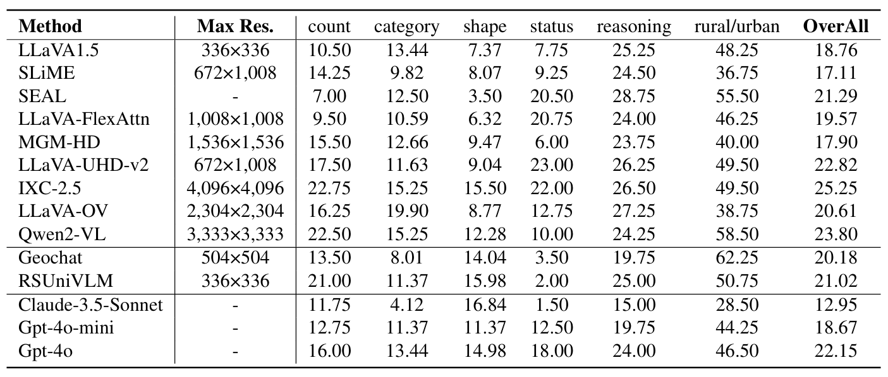
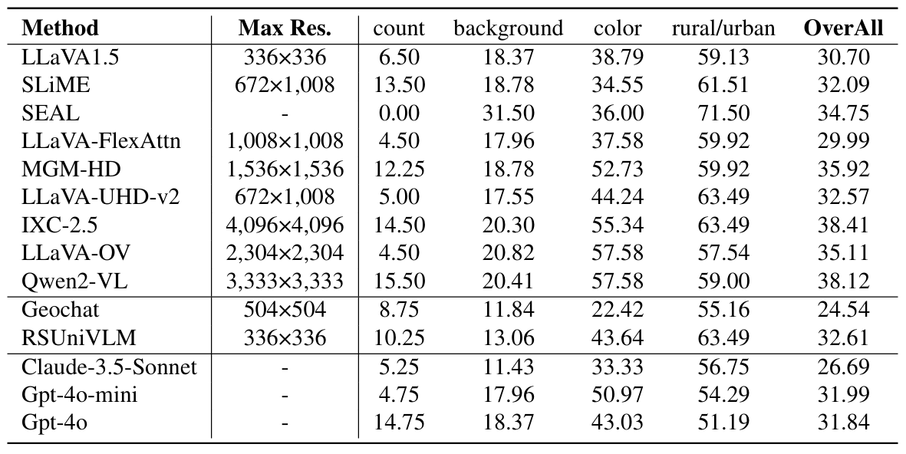

<div align='center'>
<font size=3>

[[📖 Paper](https://openaccess.thecvf.com/content/ICCV2025/html/Luo_When_Large_Vision-Language_Model_Meets_Large_Remote_Sensing_Imagery_Coarse-to-Fine_ICCV_2025_paper.html)] 
[[📊 LRS-VQA Dataset](https://huggingface.co/datasets/ll-13/LRS-VQA)]
[[🛠️ Code](LRS-VQA-Code)] 

</font>
</div>

## When Large Vision-Language Model Meets Large Remote Sensing Imagery: Coarse-to-Fine Text-Guided Token Pruning

<h3 align="center">
  <a href="#-method">Method</a> |
  <a href="#-lrs-vqa-benchmark">Benchmark</a> |
  <a href="#-getting-started">Getting Started</a> |
  <a href="#-inference">Inference</a> |
  <a href="#citation">Citation</a>
</h3>
<br>

**[2026/2/14]** Code and model weights are released.  
**[2025/6/26]** Our paper is accepted by **ICCV 2025**!  
**[2025/3/11]** **LRS-VQA** Benchmark is now released!


This project focuses on efficient perception of Large Remote Sensing Images (RSIs) using Large Vision-Language Models (LVLMs) under limited resources, covering the following key aspects:

- **Coarse-to-Fine Focusing & Pruning:** An iterative process that zooms from coarse, low-resolution overviews into fine-grained, high-resolution views to focus and analyze text-related regions.
- **Region Focus Module (RFM):** Learns text-aware key region localization capabilities from LVLM through attention distillation, enabling focused analysis on critical image tiles.
- **LRS-VQA:** A new benchmark for Large RSI perception, featuring 7,333 QA pairs across 8 categories, with images reaching up to 27,328 pixels in length and an average size of 7,099×6,329 pixels.

## 📝 TODO 
- [x] Release benchmark.
- [x] Release code and model weights.
- [ ] Release training script.
---

## 🛠️ Method

Our method introduces: (i) a **Region Focus Module (RFM)** that leverages text-aware region localization capability to identify critical vision tokens, and (ii) a **coarse-to-fine image tile selection and vision token pruning strategy** based on DIP, which is guided by RFM outputs and avoids directly processing the entire large imagery.

#### 1. Region Focus Module (RFM)


<p align="center">Schematic illustration of the Region Focus Module (RFM).</p>

The RFM aims at learning text-aware key vision tokens localization from the LLM part of LVLM by employing **attention distillation**, which allows it to focus on the most relevant parts of an image for detailed analysis. 


`The phenomenon within the LVLMs was first observed in small-size general images:`


<!-- <p align="center">Text-based attention convergence in general images.</p> -->


#### 2. Coarse-to-Fine Token Pruning


<p align="center">The overall pipeline of our proposed method.</p>

Initially, the DIP is constructed based on the input large RSI. At the low-resolution DIP level, the RFM provides attention distribution for the initial vision tokens, which guides the retrieval of corresponding image tiles from higher-resolution DIP levels or trigger token pruning at the current level. This iterative process could continue through the pyramid until reaching the original resolution.

---

## 📚 LRS-VQA Benchmark


<p align="center">
    
</p>
<p align="center">
    Construction process of LRS-VQA.
</p>

[MME-RealWorld](https://github.com/yfzhang114/MME-RealWorld) has provided a high-quality benchmark for multiple domains. In the field of remote sensing, we aim to further enrich the types of tasks and reflect the challenges of large RSI perception. **LRS-VQA** includes 1,657 images ranging in length from **1,024 to 27,328 pixels**, covering 8 different types of questions, and contains **7,333** QA pairs.

<p align="center">
    
</p>
<p align="center">
    The accuracy trends of Qwen2-VL across varying input maximum pixels. This demonstrates that accuracy on both the manually annotated MME-RealWorld-RS and our proposed LRS-VQA exhibit a positive correlation with resolution improvement, proving the effectiveness of LRS-VQA in evaluating LVLM's high-resolution RSI perception capabilities.
</p>

### Download and Evaluation

To get started with the dataset and evaluation scripts, follow these steps:

- **Source Images:**
  The source images are collected from multiple datasets:
  - [FAIR1M](https://arxiv.org/abs/2103.05569) (train set)
  - [GLH-Bridge](https://huggingface.co/datasets/ll-13/GLH-Bridge/tree/main) (test set)
  - [STAR](https://huggingface.co/datasets/Zhuzi24/STAR/tree/main) (test set)
  
  The LRS-VQA dataset can be found at https://huggingface.co/datasets/ll-13/LRS-VQA.

- **Evaluation:**
  To evaluate your model on LRS-VQA, please refer to our provided script for generating results:
  - [LLaVA1.5 Inference Script](Script/llava_eval_LRSVQA.py)
  
  Once you have generated the result file using `llava_eval_LRSVQA.py`, you can use the following script to evaluate your model's performance:
  - [Script/evaluation_LRSVQA.py](Script/evaluation_LRSVQA.py)


### Results

<p align="center">
    
</p>
<p align="center">
    Leaderboard and performance comparision. Average Accuracy is reported for each dataset.
</p>

<p align="center">
  
  
</p>
<p align="center">
    Efficiency comparision.
</p>

## Detailed Result

<details>
<summary>Click to view detailed results in LRS-FAIR, LRS-Bridge, and LRS-STAR</summary>

<p align="center">
    
</p>
<p align="center">
    Detailed results in LRS-FAIR.
</p>

<p align="center">
    
</p>
<p align="center">
    Detailed results in LRS-Bridge.
</p>

<p align="center">
    
</p>
<p align="center">
    Detailed results in LRS-STAR.
</p>

</details>


---

## 🚀 Getting Started

### Model Weights

We provide the model weights on ModelScope. Hugging Face weights will be uploaded soon.

| Model Base | ModelScope | Hugging Face |
| :--- | :---: | :---: |
| **LLaVA-NeXT-7B** (Qwen2) | [](https://www.modelscope.cn/models/llhjl123/llava-largeimg-Qwen2-7B) | []() |
| **LLaVA-1.5-7B** (Vicuna) | [](https://www.modelscope.cn/models/llhjl123/llava-largeimg-Vicuna-7B) | []() |


### 1. Environment Setup

We recommend using Conda to manage the environment. This project requires **Python 3.10** and is tested on NVIDIA A100/A800 GPUs.

```bash
# Create and activate the conda environment
conda create -n lrsvqa python=3.10 -y
conda activate lrsvqa

# Upgrade pip
pip install --upgrade pip
```

### 2. Install PyTorch

The required PyTorch version depends on your **NVIDIA Driver Version** (check with `nvidia-smi`).

* **For Modern Drivers (Version >= 525.60):**
```bash
pip install torch==2.1.2 torchvision==0.16.2 --index-url [https://download.pytorch.org/whl/cu121](https://download.pytorch.org/whl/cu121)
```

* **For Older Drivers (Version < 525.60, e.g., 470.xx):**
If you encounter a `RuntimeError` related to an old NVIDIA driver, you must use the CUDA 11.8 compiled version:
```bash
pip install torch==2.1.2+cu118 torchvision==0.16.2+cu118 --extra-index-url [https://download.pytorch.org/whl/cu118](https://download.pytorch.org/whl/cu118)
```

### 3. Install Dependencies

```bash
cd LRS-VQA-Code
# Install base and training requirements
pip install -e .
pip install -e ".[train]"

# Install specific versions of other key packages
pip install flash-attn==2.6.3 --no-build-isolation
pip install bitsandbytes==0.43.3 safetensors==0.4.5 pydantic==2.9.1 peft==0.3.0
```

---


## ⚙️ Inference

### Step 1: Apply Environment Patch (Crucial)

⚠️ **Important**: Our model includes custom modifications that require patching your local `transformers` library installation. Before running inference, please copy our modified modeling files into your conda environment.

```bash
# Get the site-packages path of your conda environment
SITE_PACKAGES=$(python -c 'import site; print(site.getsitepackages()[0])')

# Copy the patched files (Execute from project root)
cp ./LRS-VQA-Code/llava/model/multimodal_encoder/transformers/models/llama/modeling_llama.py $SITE_PACKAGES/transformers/models/llama/
cp ./LRS-VQA-Code/llava/model/multimodal_encoder/transformers//models/qwen2/modeling_qwen2.py $SITE_PACKAGES/transformers/models/qwen2/
cp ./LRS-VQA-Code/llava/model/multimodal_encoder/transformers//modeling_outputs.py $SITE_PACKAGES/transformers/

```

### Step 2: Prepare Data

Depending on which benchmark you wish to evaluate, follow the corresponding instructions below.

#### Option A: For MME-RealWorld (Remote Sensing) Evaluation

1. **Download**: Obtain the dataset from the official [MME-RealWorld repository](https://github.com/MME-Benchmarks/MME-RealWorld).
2. **Organize**: Arrange your files as shown below. The evaluation script will need the path to this main data directory.

```text
/path/to/your/MME_RealWorld/
├── MME_RealWorld_RS.json
├── evaluation/
│   └── eval_your_results.py
└── remote_sensing/
    ├── 03553_Toronto.png
    ├── 03555_Toronto.png
    └── ...
```

#### Option B: For LRS-VQA Benchmark Evaluation

1. **Download**: Download the dataset from our [Hugging Face repository](https://huggingface.co/datasets/ll-13/LRS-VQA).
2. **Extract**: Place all downloaded parts in the same directory. Use `7-Zip` (Windows) or `p7zip` (Linux) to extract the archive by running the command on the first file (`.001`).

```bash
# Example using p7zip on Linux
7z x LRS_VQA.7z.001
```

3. **Verify Structure**: After extraction, you will have an `LRS_VQA` folder. The evaluation script expects the path to its **parent directory**. Ensure your final structure looks like this:

```text
/path/to/dataset_parent_directory/
└── LRS_VQA/
    ├── LRS_VQA_merged.jsonl
    └── image/
        ├── 15565.tif
        ├── 9043.tif
        └── ...
```

### Step 3: Run Inference

We provide shell scripts to simplify the evaluation process.

**To evaluate on LRS-VQA:**

```bash
bash LRS-VQA-Code/eval_lrs_vqa.sh
```

**To evaluate on MME-RealWorld-RS:**

```bash
bash LRS-VQA-Code/eval_mme-realworld-rs.sh
```

## Citation

If you find this work helpful for your research, please consider giving this repo a star ⭐ and citing our paper:

```bibtex
@InProceedings{Luo_2025_ICCV,
    title={When Large Vision-Language Model Meets Large Remote Sensing Imagery: Coarse-to-Fine Text-Guided Token Pruning},
    author={Luo, Junwei and Zhang, Yingying and Yang, Xue and Wu, Kang and Zhu, Qi and Liang, Lei and Chen, Jingdong and Li, Yansheng},
    booktitle={Proceedings of the IEEE/CVF International Conference on Computer Vision (ICCV)},
    month={October},
    year={2025},
    pages={9206-9217}
}

@article{li2024scene,
    title={STAR: A First-Ever Dataset and A Large-Scale Benchmark for Scene Graph Generation in Large-Size Satellite Imagery},
    author={Li, Yansheng and Wang, Linlin and Wang, Tingzhu and Yang, Xue and Luo, Junwei and Wang, Qi and Deng, Youming and Wang, Wenbin and Sun, Xian and Li, Haifeng and Dang, Bo and Zhang, Yongjun and Yu, Yi and Yan Junchi},
    journal={IEEE Transactions on Pattern Analysis and Machine Intelligence},
    year={2024},
    publisher={IEEE}}

@article{li2024learning,
    title={Learning to Holistically Detect Bridges From Large-Size VHR Remote Sensing Imagery},
    author={Li, Yansheng and Luo, Junwei and Zhang, Yongjun and Tan, Yihua and Yu, Jin-Gang and Bai, Song},
    journal={IEEE Transactions on Pattern Analysis and Machine Intelligence},
    volume={44},
    number={11},
    pages={7778--7796},
    year={2024},
    publisher={IEEE}
}
```

## Acknowledgement
We thank the authors of [MME-RealWorld](https://github.com/yfzhang114/MME-RealWorld) and [PyramidDrop](https://github.com/Cooperx521/PyramidDrop) for their great works and codebases.
